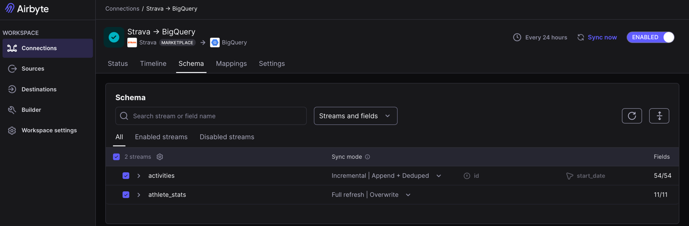

# 🏃‍♂️ Strava Data Analytics Pipeline

Ce projet implémente un pipeline ELT (Extract, Load, Transform) complet pour automatiser la récupération de mes données Strava et les transformer en données exploitables.

##  Choix Technologiques & Architecture

### Phase 1 : Récupérer des données (Extract & Load)
* **Source** : API Strava (OAuth2).
* **Outil de transport** : **Airbyte Open Source** déployé sur Docker.

Airbyte est une plateforme d'intégration de données qui aide à répliquer et à consolider facilement des données provenant de différentes sources (bases de données, API, applications SaaS). J'ai choisi cet outil car il est open source et propose un connecteur déjà prêt pour l'API Strava. C'est une solution reconnue qui répondait exactement à mon besoin technique.

####  Installation (Airbyte)
Lors de l'installation, j'ai rencontré des difficultés liées à la puissance de calcul de mon Mac. Pour optimiser l'utilisation de la RAM sur MacOS, j'ai utilisé le mode spécifique de consommation réduite `--low-resource-mode`.

**Commandes de gestion :**
* **Démarrer** : `abctl local install --low-resource-mode --insecure-cookies`
* **Stopper** : `abctl local uninstall`

####  Configuration de la Source (Strava API)
* **Connexion** : Utilisation du protocole **OAuth2** en suivant la documentation officielle d'Airbyte.
* **Historique** : Paramétrage de la date de début au **1er janvier 2015** afin d'importer l'intégralité de mon historique sportif.
* **Sécurité** : Les identifiants sensibles (`Client ID`, `Client Secret`) sont gérés uniquement dans l'interface locale d'Airbyte.

#### Configuration de la Destination (Google BigQuery)
Pour le stockage et l'analyse, j'ai choisi **Google BigQuery** comme Data Warehouse Cloud pour sa capacité à gérer de gros volumes et sa facilité de connexion aux outils de visualisation.

* **Projet GCP (Google Cloud Platform)** : Création du projet `dashboardstrava1`.
* **Sécurité** : Création d'un **compte de service** spécifique pour isoler les accès.
* **Droits d'accès** :
    * `Administrateur BigQuery` : Pour permettre à l'outil d'écrire les données.
    * `Administrateur Storage` : Sert de zone tampon pour fluidifier l'importation des gros volumes.
* **Dataset** : Données stockées dans `strava_raw` (Localisation : EU).

##  Paramétrage du flux (Sync Mode)

J'ai configuré deux modes différents dans Airbyte pour optimiser le pipeline :

* **Activités (`Incremental | Append + Deduped`)** :
  Ce mode permet de ne récupérer que les nouvelles activités sportives. Airbyte utilise l'identifiant unique (`id`) pour éviter les doublons. Cela permet un chargement plus rapide et réduit la consommation de ressources.

* **Statistiques (`Full Refresh | Overwrite`)** :
  Pour mes records personnels et totaux globaux, j'ai choisi de remplacer intégralement les données à chaque passage. Ces informations n'ayant pas d'ID unique, ce mode est nécessaire pour garantir des données toujours à jour.

---

## Phase 2 : Transformation (Couche ODS)

L'objectif de cette étape est de transformer les données brutes (`strava_raw`) pour créer un dataset ODS (`strava_ods`) propre et structuré.

### Objectifs de la couche ODS
* **Nettoyage** : Passage d'un format JSON à une structure SQL exploitable.
* **Extraction des données** : Sélection des seules données jugées pertinentes (distance, vitesse, dénivelé, kudos, etc.).
* **Données sensibles** : Suppression définitive des coordonnées GPS et des identifiants personnels dès cette étape pour ne pas les stocker dans le reste du projet.

### Points techniques de la mise en place
* **Vérification du typage** : Utilisation d'une table de test (`test_format`) pour confirmer que BigQuery et Airbyte interprètent correctement les types numériques (`NUMERIC`, `INTEGER`).
* **Traitement du JSON** : Extraction des données imbriquées pour la table `athlete_stats`. J'ai utilisé la fonction **`CAST`** pour transformer les données textuelles issues du JSON en formats numériques, ce qui permet de réaliser des calculs par la suite.

> **Pour consulter le détail du mapping, les justifications de filtrage et les échantillons de données, voir : [Documentation détaillée ODS](./docs/ODS/README.md)**
---