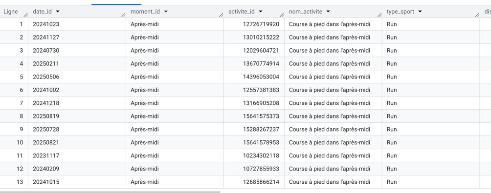
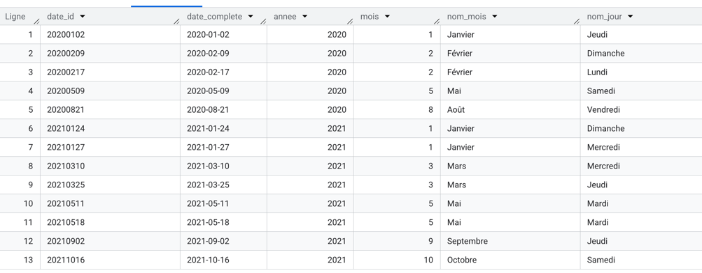

# Documentation détaillée - Couche DWH

Ce document détaille la phase de modélisation des données vers le dataset DWH (`strava_dwh`). L'objectif est de transformer les données de l'ODS en un **Schéma en Étoile** optimisé pour l'analyse dans Power BI.

## 1. Architecture du Modèle

Pour faciliter l'analyse, j'ai structuré le Data Warehouse autour d'une table de faits centrale et de tables de dimensions.

* **Table de Faits** : `fct_activites` (contient les mesures et les clés de liaison).
* **Dimensions** : `dim_calendar` (temps) et `dim_moment_journee` (contexte horaire).
* **Table de Faits Snapshot** : `fct_global_stats` (statistiques historiques cumulées).

---

## 2. Logique de Transformation : Table `fct_activites`

Cette table centralise chaque activité avec des unités de mesure standardisées pour le dashboard.

### Conversions et calculs métiers
Plusieurs transformations ont été appliquées pour obtenir des indicateurs parlants :
* **Distance** : Conversion des mètres en kilomètres (`distance / 1000`).
* **Vitesse** : Conversion des mètres/seconde en km/h (`average_speed * 3.6`).
* **Allure ** : Création de la métrique `allure_min_km` (min/km). J'ai utilisé la fonction `SAFE_DIVIDE` pour éviter les erreurs de division par zéro.

### Note sur le formatage des données (Décimal vs Horaire)
Les durées (minutes) et les allures (min/km) sont volontairement stockées au format **décimal** (`FLOAT64`) dans le DWH.
* **Justification technique** : Le format numérique est indispensable pour réaliser des agrégations mathématiques (moyennes, sommes, max).
* **Visualisation** : Le formatage final en "Minutes:Secondes" (ex: 36.75 -> 36:45) sera géré directement dans Power BI via des mesures.

### Gestion technique des dates
L'API Strava fournit des dates au format ISO (ex: `2024-11-06T17:39:05Z`). Pour générer la clé de liaison `date_id` au format `YYYYMMDD`, j'ai dû passer par une conversion `TIMESTAMP` avant le formatage pour éviter les erreurs de cast direct en date.

---

## 3. Les Dimensions

### `dim_calendar`
Cette table génère chaque jour du 01/01/2020 au 31/12/2026.
* **Hiérarchies** : Ajout des colonnes **Trimestre** et **Semestre** pour des bilans saisonniers.
* **Weekend** : Un indicateur `est_weekend` permet d'analyser les habitudes d'entraînement en fonction des jours de repos. 
* L’utilisation d'instructions CASE rend la requête plus longue, mais ce choix permet de traduire les jours et les mois directement en amont afin de livrer des données prêtes à l'emploi pour Power BI et d'optimiser les performances du dashboard.

### `dim_moment_journee`
Permet de segmenter les activités selon l'heure de départ (Matin, Soir, etc.).
* **Ordre de tri** : J'ai ajouté une colonne `ordre_tri` pour forcer un affichage chronologique dans les graphiques Power BI.

---

## 4. Statistiques Globales : `fct_global_stats`

Bien que Power BI puisse recalculer des sommes à partir de la table de faits, j'ai choisi de conserver cette table pour deux raisons :
1. **Historique complet** : Elle contient les totaux cumulés depuis 2015, incluant des activités anciennes qui ne sont pas forcément présentes dans la table de faits synchronisée.
2. **Comparaison** : Elle sert de point de comparaison pour valider des calculs réalisés dans le dashboard par rapport aux chiffres officiels de Strava.

---

## 5. Scripts de création

Les requêtes SQL finales pour la couche DWH sont archivées dans le dossier `scripts/DWH/` :

* [dim_calendar.sql](../../scripts/DWH/dim_calendar.sql)
* [dim_moment_journee.sql](../../scripts/DWH/dim_moment_journee.sql)
* [fct_activites.sql](../../scripts/DWH/fct_activites.sql)
* [fct_global_stats.sql](../../scripts/DWH/fct_global_stats.sql)

---

## 6. Visualisation des tables finales

### Vue de la table de faits `fct_activites`

### Vue de la dimension `dim_calendar`
