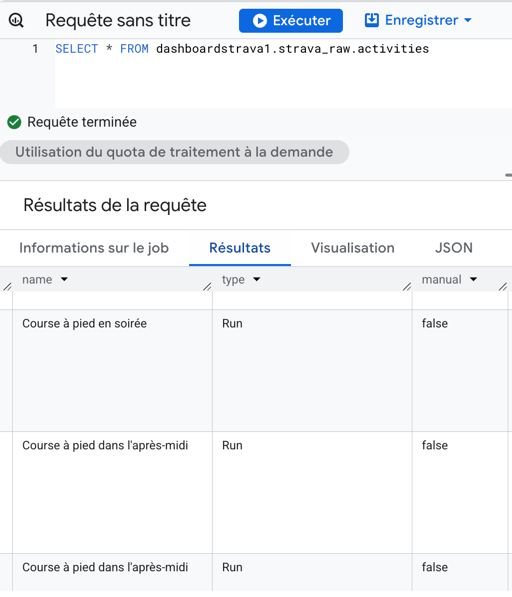
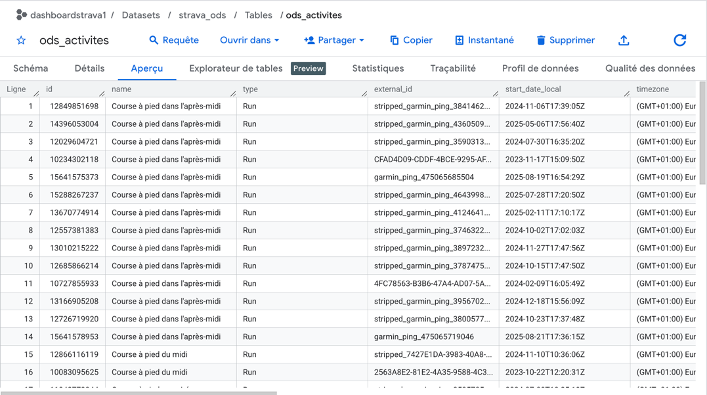

# Documentation détaillée - Couche ODS

Ce document détaille la logique de transformation des données brutes issues de l'API Strava vers le dataset ODS (`strava_ods`).

## 1. Analyse des données sources 

Avant de créer les tables, j'ai vérifié la récupération des données avec une requête simple :
`SELECT * FROM dashboardstrava1.strava_raw.activities` et `SELECT * FROM dashboardstrava1.strava_raw.athlete_stats`.


J'ai ensuite relevé deux types d'activités (natation et course à pied) ainsi que les données sur les statistiques globales de l'athlète.

>  Fichiers d'exemples :
> * [activites_exemple.json](./activites_exemple.json)
> * [athlete_stats_exemple.json](./athlete_stats_exemple.json)

---

## 2. Logique de sélection : Table `ods_activites`

Pour cette table, j'ai fait le choix de ne pas séparer les données en plusieurs tables car chaque ligne correspond à un entraînement spécifique. Il n'y a pas ici de données de dimension.

### Données conservées
* **Identifiants** : `id`, `name`, `type`, `external_id`.
* **Performance** : `distance`, `moving_time`, `elapsed_time`, `total_elevation_gain`.
* **Vitesse & Altitude** : `average_speed`, `max_speed`, `elev_low`, `elev_high`.
* **Social** : `kudos_count`, `comment_count`, `achievement_count`.

### Données écartées et justifications
J'ai choisi d'ignorer certaines colonnes car elles ne seront pas utilisées pour mes analyses futures :

1. **Données de puissance (Watts)** : Les colonnes comme `average_watts` ou `kilojoules` sont liées au cyclisme avec capteur. Elles sont à `null` dans mes données. Cela ne me sera pas utile car je n'ai pas pour projet de faire du cyclisme.
2. **Indicateurs Booleans** : Les champs `manual`, `trainer`, `commute`, `private` ou `flagged` sont soit constants, soit non prioritaires pour un dashboard de performance.
3. **Localisation vide** : `location_city`, `location_state` et `location_country` ne sont pas remplis par Strava, qui privilégie les coordonnées GPS via ma montre Garmin.
4. **Doublons techniques** : L'ID de l'athlète n'est pas utile car le dashboard est personnel. `upload_id_str` est un doublon de `upload_id`.
5. **Coordonnées GPS brutes** : Elles sont supprimées pour éviter de stocker des données sensibles.

---

## 3. Logique de sélection : Table `ods_athlete_stats`

L'objectif de cette table est d'avoir une vue d'ensemble de la progression depuis 2015.

### Extraction et choix des données
1. **Totaux (`Totals`)** : Extraction du nombre de séances (`count`), de la distance et du temps de mouvement pour la course et la natation. Ces données permettent de calculer des moyennes globales sur l'historique complet.
2. **Records (`Biggest Totals`)** : Conservation des records comme `biggest_ride_distance` pour comparer l'activité la plus longue avec le reste de l'historique.
3. **Données récentes évitées** : Les colonnes `recent_run_totals` ne sont pas conservées car il est préférable de recalculer ces statistiques dans le DWH à partir de la table d'activités détaillée.

---

## 4. Implémentation technique et validation

### Test du typage
Un test a été effectué sur un échantillon (`test_format`) pour vérifier le formatage d'Airbyte et BigQuery :

```sql
CREATE OR REPLACE TABLE `dashboardstrava1.strava_ods.test_format` AS
SELECT id, name, distance, moving_time, start_date_local
FROM `dashboardstrava1.strava_raw.activities`;
```
Ce test a confirmé que BigQuery et Airbyte interprètent correctement les colonnes numériques (`NUMERIC`, `INTEGER`), ce qui a permis de construire la table `ods_activites` sans transformations supplémentaires.

### 4.2 Traitement du JSON et utilisation du CAST
Pour la table `athlete_stats`, les données brutes sont stockées dans des objets JSON. J'ai utilisé la fonction `JSON_VALUE` pour extraire les données précises.

* **Le chemin JSONPath** : L'utilisation du symbole `$` suivi de la clé (ex: `$.count`) permet d'isoler une valeur spécifique à l'intérieur du bloc JSON.
* **Conversion de type** : Comme `JSON_VALUE` renvoie systématiquement du texte (`STRING`), j'ai appliqué la fonction **`CAST`**. Cela garantit que les distances et les compteurs sont convertis en formats numériques (`FLOAT64`, `INT64`) pour permettre les calculs et les agrégations dans le DWH.

---

## 5. Scripts de création

Les requêtes SQL finales utilisées pour générer cette couche ODS sont archivées dans le dossier `scripts/ODS/` :

* [ods_activites.sql](../../scripts/ODS/ods_activites.sql)
* [ods_athlete_stats.sql](../../scripts/ODS/ods_athlete_stats.sql)


ODS Activité vue final  : 


ODS Atlhete Stat vue final : 
