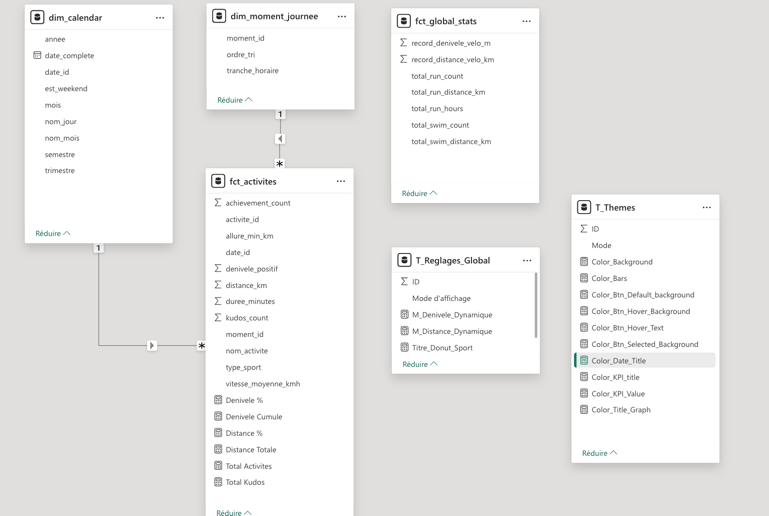
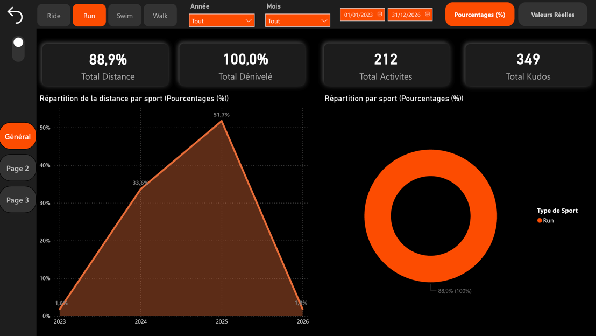
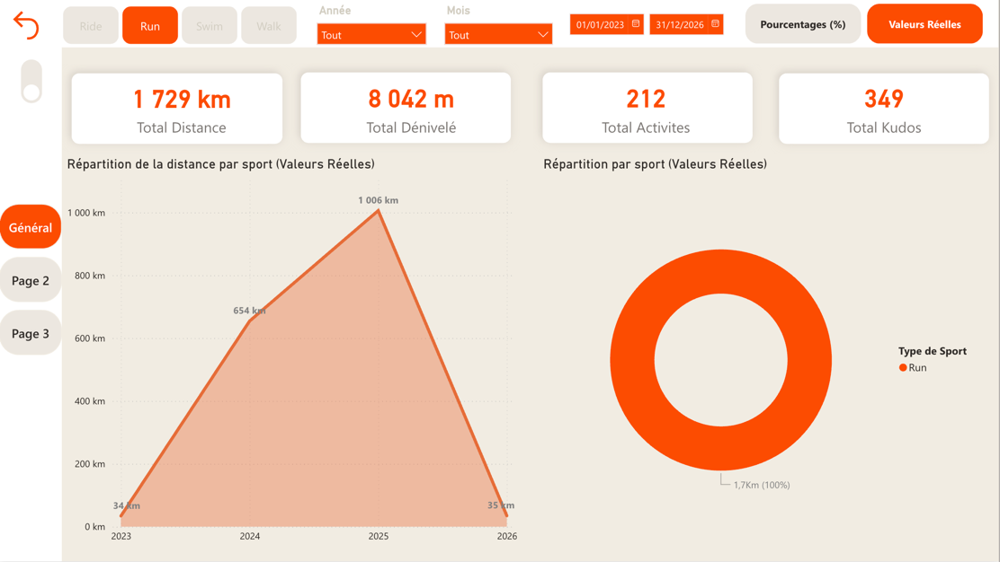

# Phase 4 : Conception du Dashboard (Power BI)

Cette section documente la phase de réalisation du dashboard interactif. L'objectif est de transformer les données structurées dans le Data Warehouse BigQuery en un outil d'aide à la décision pour le suivi sportif.

---

## 1. Objectifs du Dashboard (Le "Pourquoi")

L'enjeu est de transformer mes données brutes Strava en données exploitables. Le dashboard répond à trois besoins majeurs :

* **Pilotage de la progression** : Suivre l'évolution des performances (allure, distance, cardio) sur le long terme.
* **Analyse comportementale** : Identifier mes habitudes de pratique (pics d'activité hebdomadaires, moments de la journée les plus productifs).
* **Référentiel historique** : Centraliser mes records personnels et mes totaux globaux depuis plusieurs années, servant de "source de vérité" unique.

---

## 2. Indicateurs Clés - KPIs (Le "Quoi")

Les métriques sont issues de la table de faits `fct_activites` et de la table snapshot `fct_global_stats` de BigQuery :

### A. Volume & Régularité
* **Distance Totale** : Cumul kilométrique (affichable en valeur réelle ou en %).
* **Dénivelé Positif** : Somme des ascensions (mètres).
* **Volume d'activités** : Nombre de séances pour mesurer la régularité.

### B. Performance & Physiologie
* **Allure Moyenne (Pace)** : Calculée dynamiquement en min/km (spécifique à la course).
* **Vitesse Moyenne** : Performance brute exprimée en km/h.
* **Intensité Cardiaque** : Suivi des BPM moyens et maximums pour surveiller la charge d'effort.

### C. Engagement & Social
* **Kudos Score** : Analyse de l'interaction sociale moyenne par activité.

---

## 3. Stratégie Visuelle (Le "Comment")

Pour assurer une lecture fluide et un look "Application", j'ai sélectionné des visuels adaptés à chaque type de donnée :

| Type de visuel         | Utilisation prévue |
|:-----------------------| :--- |
| **Cartes** | Affichage des KPIs prioritaires avec intégration d'icônes et effets d'ombre. |
| **Graphique en Aires** | Visualisation de l'évolution des distances dans le temps pour voir les cycles d'entraînement. |
| **Donut Chart** | Répartition du volume par type de sport (Run, Ride, Swim). |
| **Slicers (Segments)** | Filtrage dynamique par Année, Mois et Type de sport pour explorer la donnée. |
| **Boutons d'Action** | Switch interactif pour le mode Jour/Nuit et le basculement Valeurs/Pourcentages. |

---

## 4. Mise en œuvre technique (La Réalisation)

### A. Modélisation Sémantique
Pour garantir la fluidité du rapport et la précision des calculs, j'ai structuré les données selon un **schéma en étoile** :
* **Table de faits (`fct_activites`)** : Elle centralise toutes les mesures de mes séances (distance, allure, cardio).
* **Dimensions** : Les tables `dim_calendar` et `dim_moment_journee` permettent de filtrer les faits avec précision. La liaison entre le calendrier et les activités repose sur une clé technique `date_id` (format YYYYMMDD).
* **Tables de gestion (`T_Themes` et `T_Reglages_Global`)** : Ces tables techniques pilotent les fonctionnalités de personnalisation dynamique du dashboard.

### B. Intelligence métier et DAX Dynamique
L'une des complexités de ce projet a été de rendre le rapport vivant et interactif. Au lieu de figer les visuels, j'ai créé des **mesures DAX dynamiques** pour offrir une expérience personnalisée :
* **Gestion des Thèmes** : Les couleurs (fond, textes, boutons) ne sont pas fixes. Elles sont pilotées par des mesures utilisant la fonction `SWITCH` pour basculer instantanément entre les codes couleurs du mode Jour et du mode Nuit.
* **Sélecteur d'unité** : J'ai mis en place une mesure de calcul de distance dynamique. Elle permet de changer l'affichage de tout le dashboard entre les **valeurs réelles** (km) et les **pourcentages** (%) d'un simple clic, offrant deux niveaux d'analyse sur un seul écran.

---

## 5. Expérience Utilisateur & Design (UX/UI)

La réalisation visuelle a représenté un défi pour allier le design et l'intuitivité.

### Défis de conception et choix graphiques
* **Agencement** : J'ai dû choisir où placer chaque élément pour ne pas surcharger l'écran tout en restant intuitif au premier coup d'œil.
* **Choix des couleurs** : J'ai cherché l'équilibre pour mettre en avant les infos clés avec l'orange Strava, que ce soit sur le fond noir ou le fond crème.
* **Rendu visuel** : Utilisation d'ombres pour donner un aspect moderne et moins "plat" au dashboard, comme sur une application mobile.

### Rendu Final

| Mode Nuit (Focus Performance) | Mode Jour (Clarté & Lecture)                 |
| :--- |:---------------------------------------------|
| |                                              |
| *Optimisé pour une consultation en intérieur.* | *Optimisé pour une lecture claire et aérée.* |

---
## 6. Limites et Pistes d'Amélioration

La réalisation du dashboard via l'interface Web de Power BI a imposé certaines contraintes techniques qui limitent la personnalisation finale :

* **Intégration d'images** : Les limites de la version Web ne permettaient pas d'insérer facilement des icônes ou des visuels personnalisés au sein des cartes KPI. L'ajout d'icônes spécifiques pour chaque sport (course, vélo) aurait permis de rendre l'interface encore plus visuelle.
* **Navigation sur mesure** : La création de boutons de navigation totalement personnalisés est plus restreinte sur le Web. Une amélioration possible serait d'utiliser la version Desktop pour concevoir une barre de navigation plus ergonomique, renforçant l'aspect "Application" du dashboard, comme une maison pour la page d'acceuil.

## 7. Évolutions futures

Je vais continuer le développement de ce dashboard et ajouter différentes pages d'analyse dans le futur.

---
